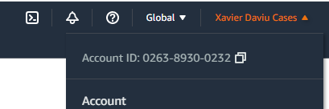
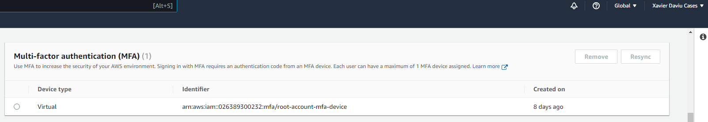
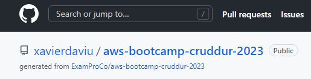
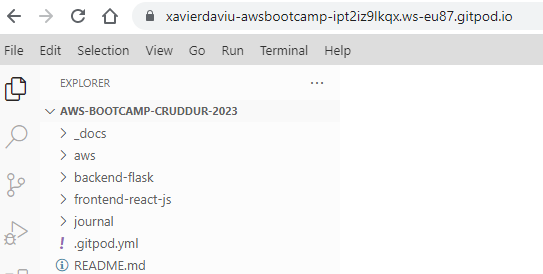
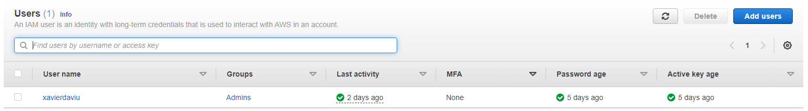
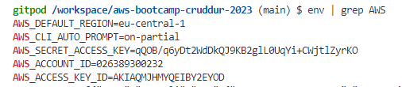
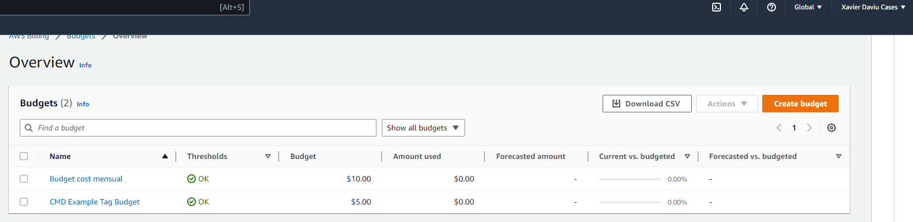
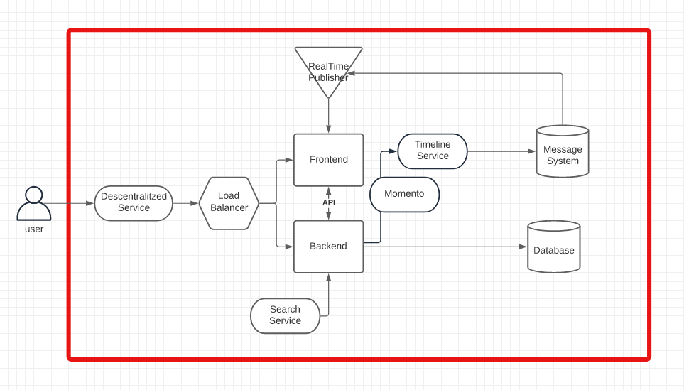

# Week 0 — Billing and Architecture

## As Homework I've done:

**Create AWS root accound**

**Secure account with MFA**

**Create Github & Gitpod accounts**

**Create repository from ExamProCo/aws-bootcamp-cruddur-2023 and open it in Gitpod**

**Create new Admin User**

**Create new user a access key as the examples**

**Create AWS Billing Budget**

**Learn to use Lucid Charts and draw the 2 diagrams**

