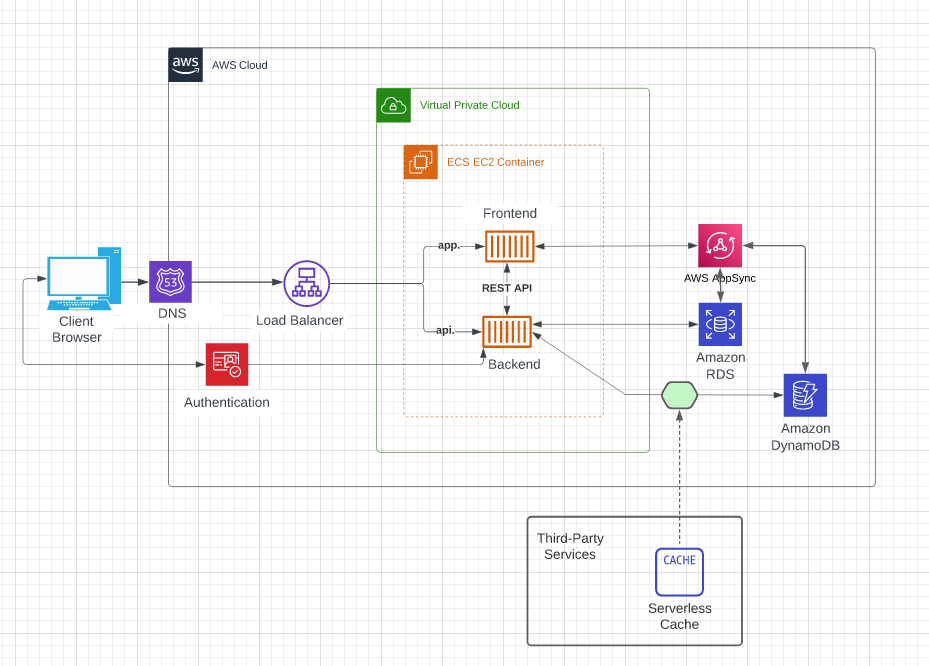

# Week 0 — Billing and Architecture

## As Homework I've done:

**Create AWS root accound**

**Secure account with MFA**

**Create Github & Gitpod accounts**

**Create repository from ExamProCo/aws-bootcamp-cruddur-2023 and open it in Gitpod**

**Create new Admin User**

**Create new user a access key as the examples**

**Create AWS Billing Budget**

**Learn to use Lucid Charts and draw the 2 diagrams**

[Lucid Charts Share Link](https://lucid.app/lucidchart/d941275c-a65c-46c0-82e0-7eabed02f65d/edit?invitationId=inv_0362a03f-f277-4b4c-94e5-3be5254abd05)

[Lucid Charts Share Link](https://lucid.app/lucidchart/e0777bb6-df22-47d7-8216-828d3366709f/edit?viewport_loc=-431%2C67%2C2734%2C1349%2C0_0&invitationId=inv_e17db4a9-0dfa-42d7-80c1-447df11d0891)

