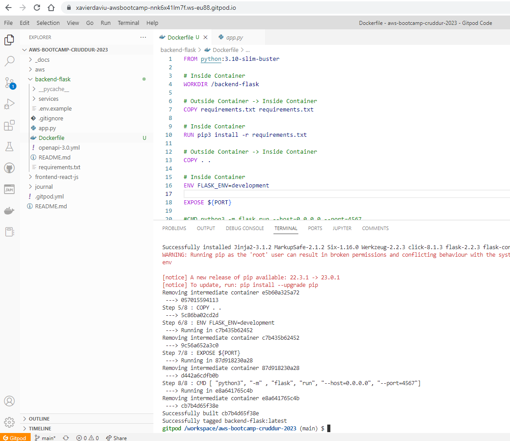
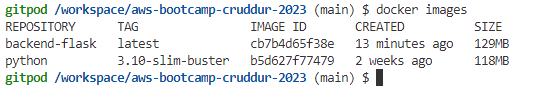
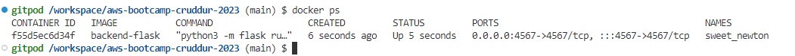
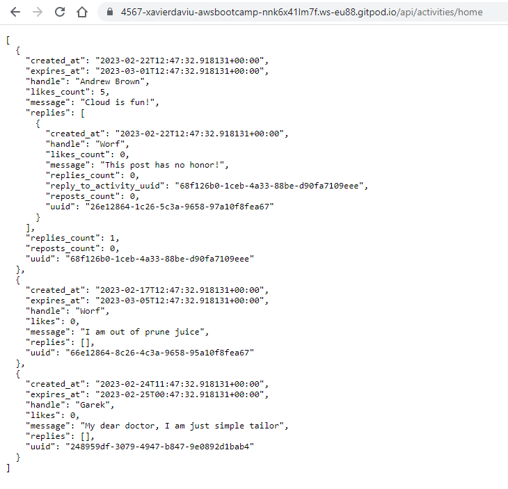
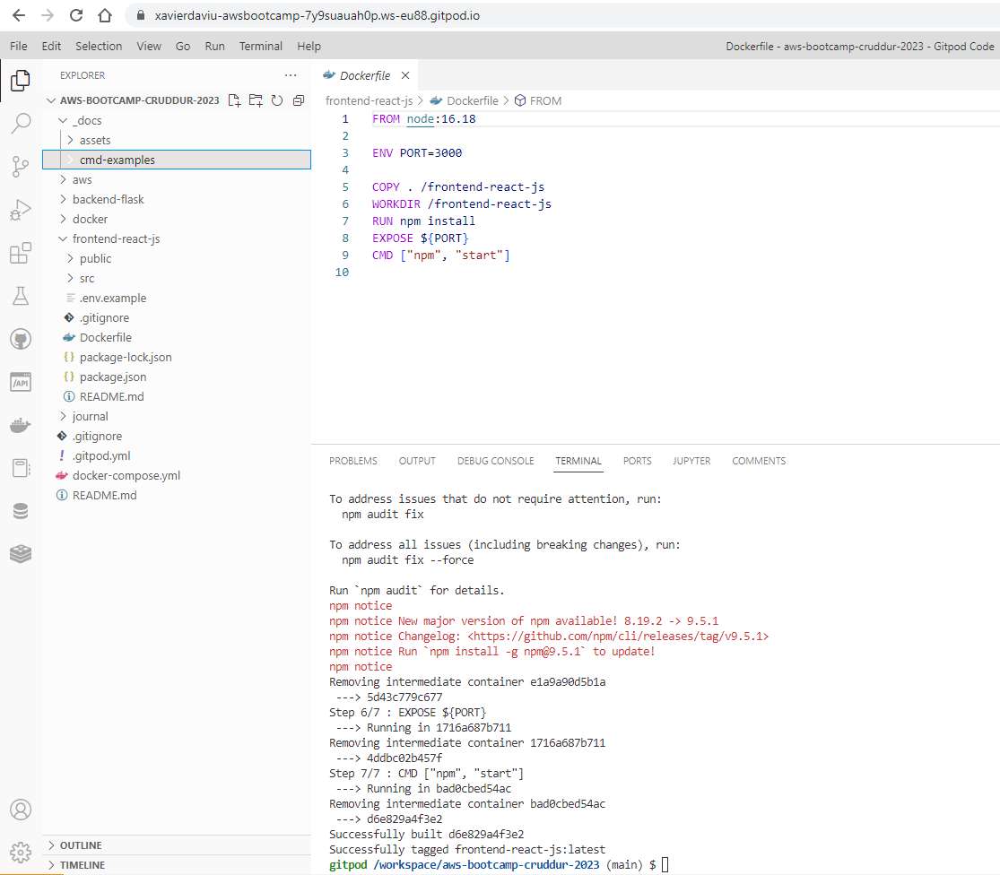
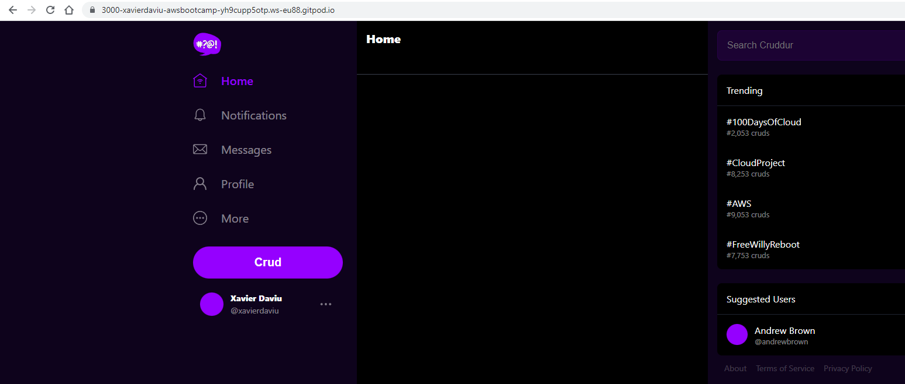
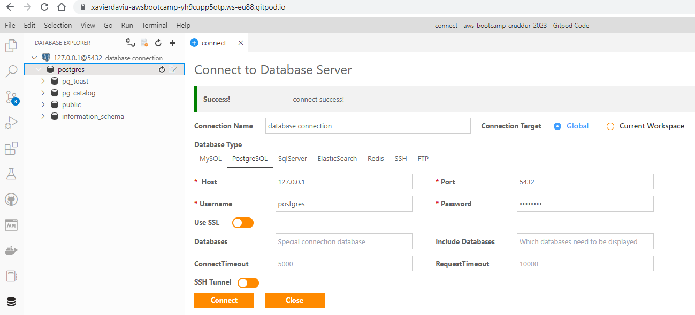
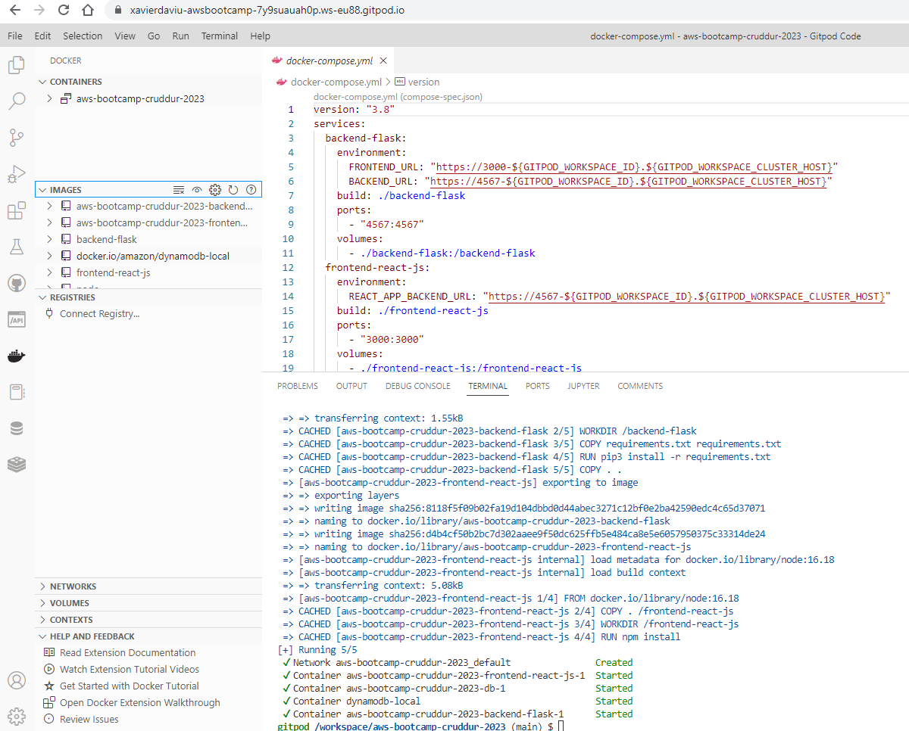

# Week 1 — App Containerization

## As Homework I've done:

**Build the back-end container image with the Dockerfile**

**Run the back-end container & test the connection**

**Build the front-end container image with the Dockerfile**

**Run the front-end container & test web**

**Test PostgreSQL database connection**

**Build all with the docker-compose.yml file**

