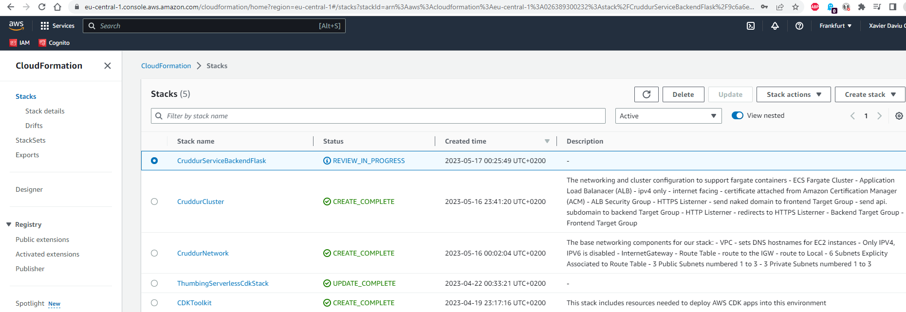
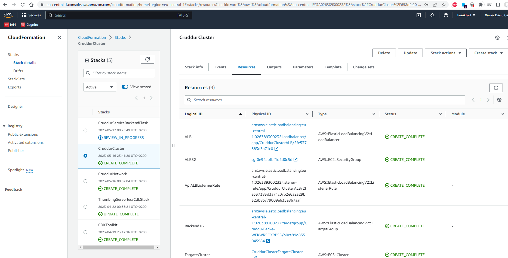

# Week 10 — CloudFormation Part 1

## As Homework I've done:

**Create a S3 bucket for the CFN artifacts**

**Create CloudFormation Stacks: network, cluster, backend-service and RDS db**

**Resources created by the Network Stack**

**Resources created by the Cluster Stack**

**Resources created by the Backend-flask Service Stack**

**Resources created by the Database Stack**

**Backend-flask service running & healthy**

**Backend-flask target group healthy**

**Check custom domain**

