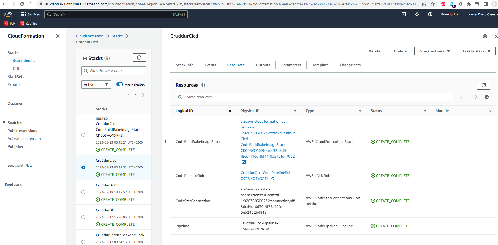
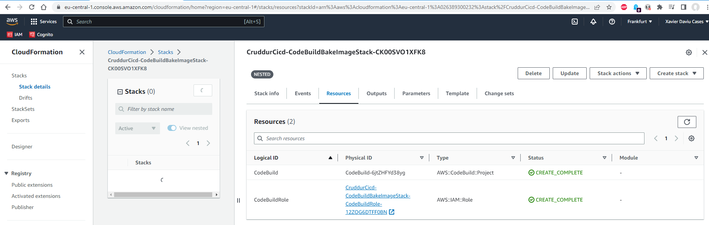
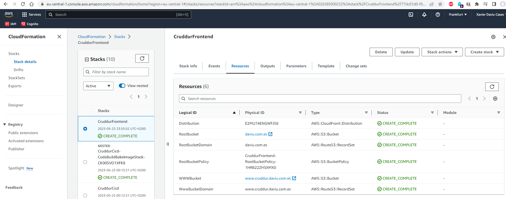

# Week 11 — CloudFormation Part 2

## As Homework I've done:

**Create CloudFormation Stacks: Dynamo DB, CI/CD & Frontend**

**Resources created by the Dynamo DB Stack**

**Resources created by the CI/CD Stack**

**Resources created by the Frontend Stack**

