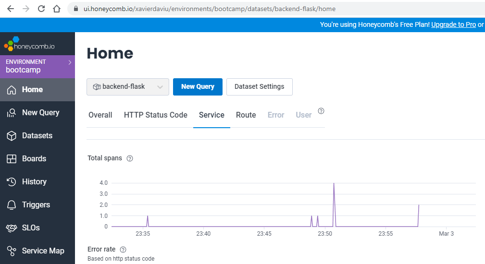

# Week 2 — Distributed Tracing

## As Homework I've done:

**Configure the backend flask app to use Open Telemetry (OTEL) with Honeycomb.io^*

**Run queries to explore traces within Honeycomb.io**

**Configure the backend flask app to send data to AWS X-Ray**

**Configure the backend flask app with WatchTower to send logs to AWS CloudWatch**

**Configure the backend flask to integrate with Rollbar**

**View error log details in Rollbar**

