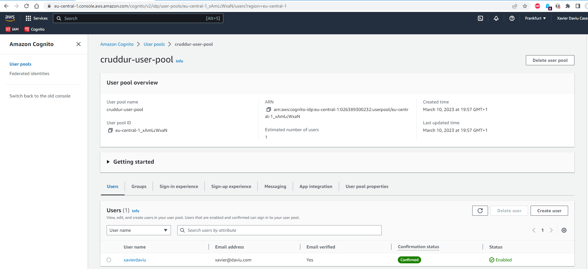
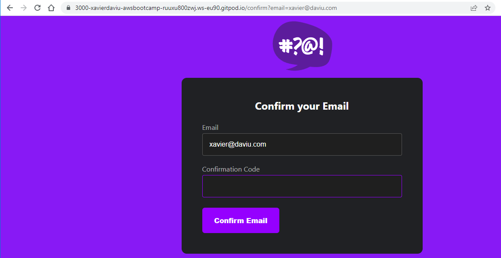
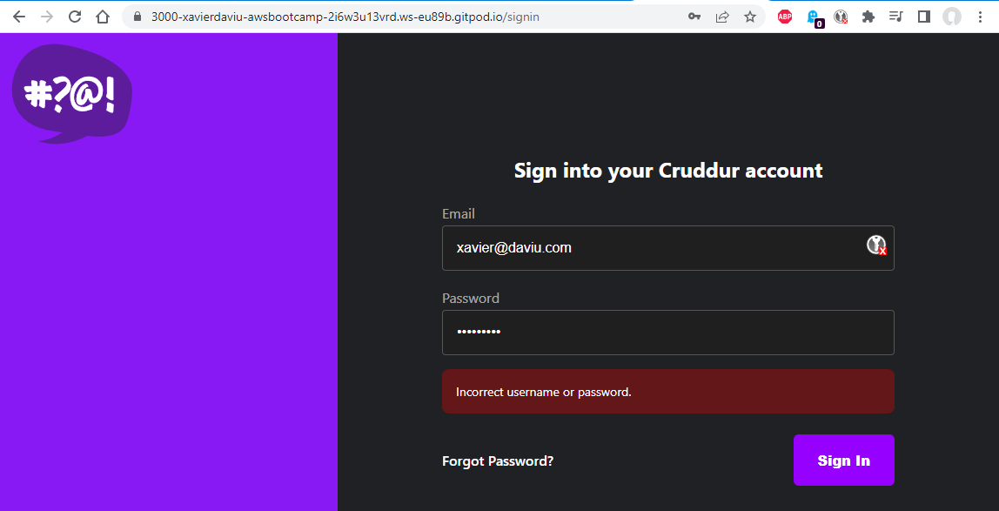
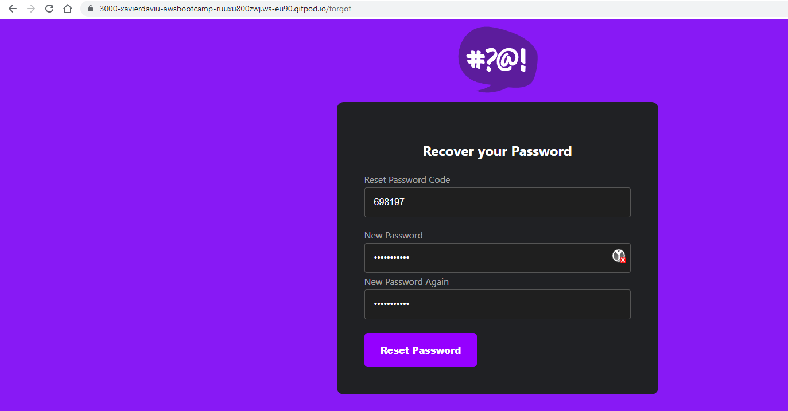
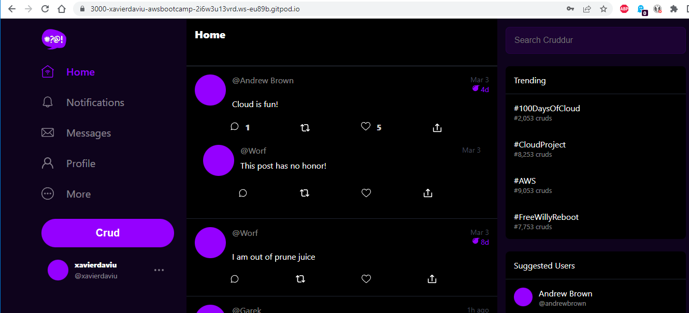
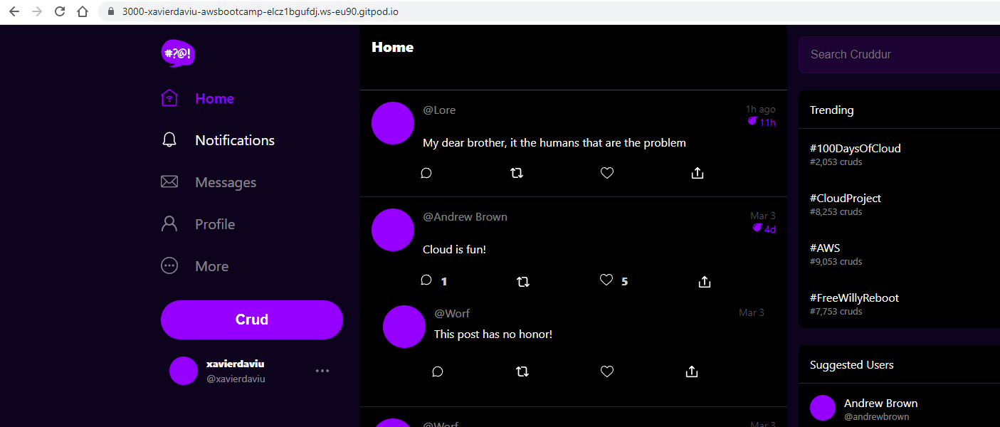
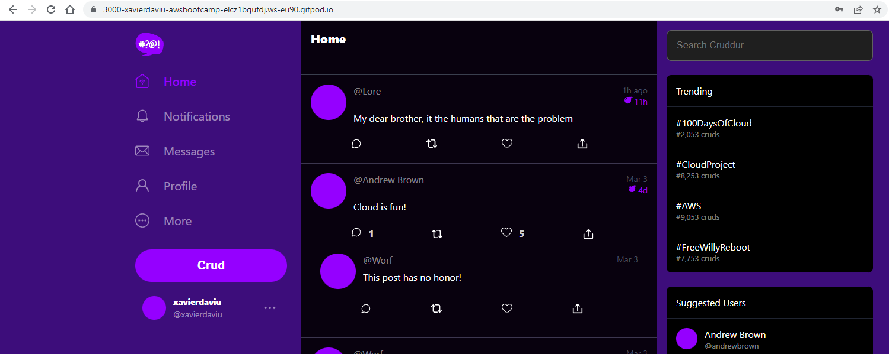

# Week 3 — Decentralized Authentication

## As Homework I've done:

**Create Amazon Cognito User Pool** 

**Use API calls to Amazon Coginto for custom login, signup, recovery and forgot password page**

**Verify JWT Token and show conditional elements and data based on logged in or logged out**

**Improve UI Contrast and implement CSS variables**

