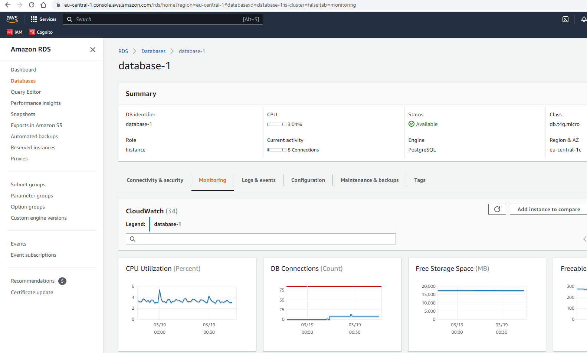
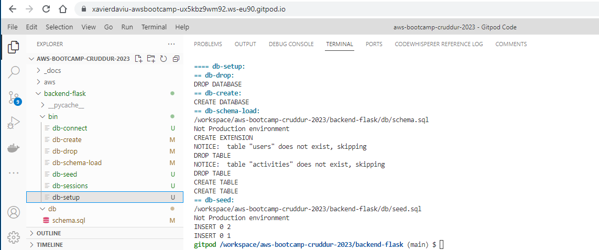
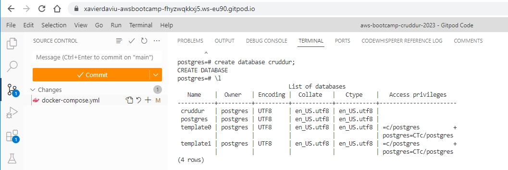
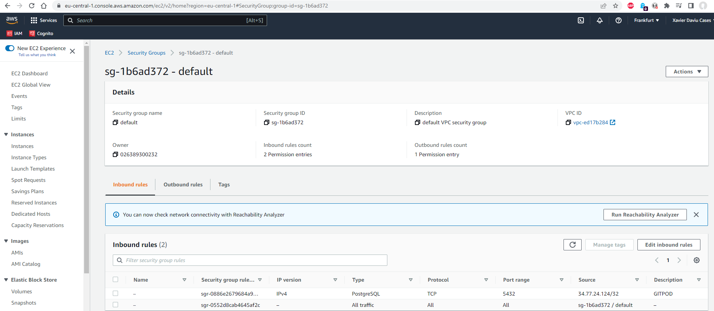
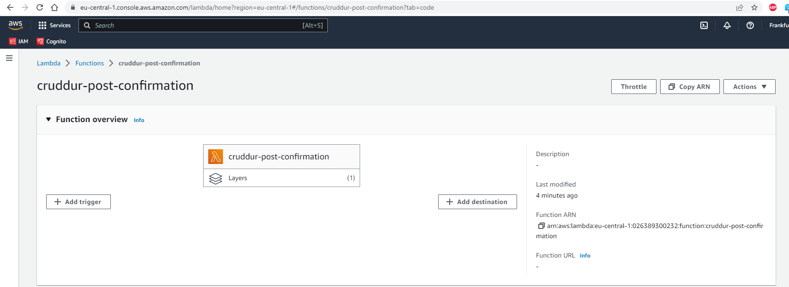
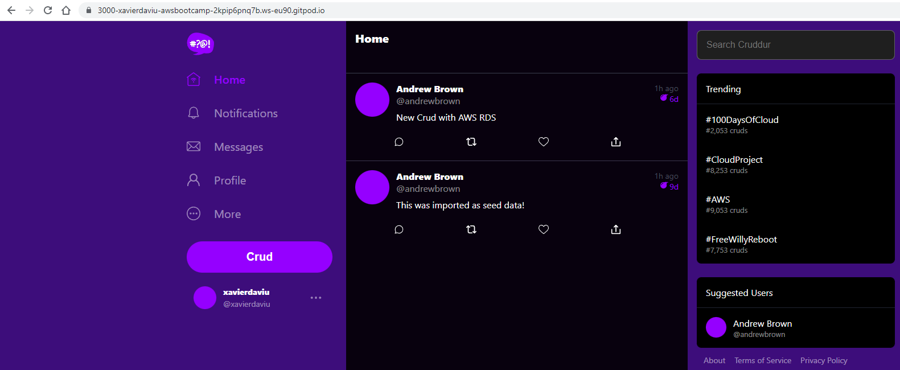

# Week 4 — Postgres and RDS

##As Homework I've done:

**Create a new RDS instance in AWS and remotely connect to it.**

**Create bash scripts for common database actions.**

**Connect Gitpod to te RDS instance and programmatically update a security group rule with Gitpod IP.**

**Create a new Lambda function as a Cognito Trigger to insert a new user into the database.**

**Work with PSQL and enable the app to insert the new activities in the database.**

