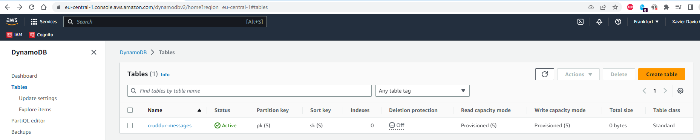
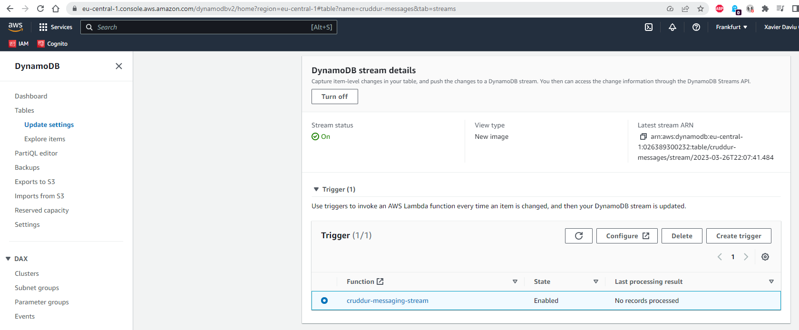
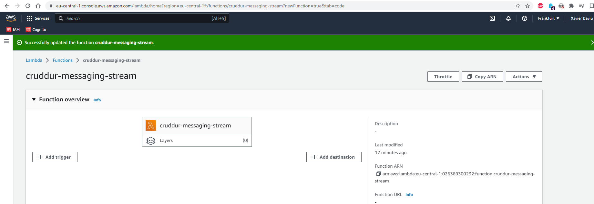
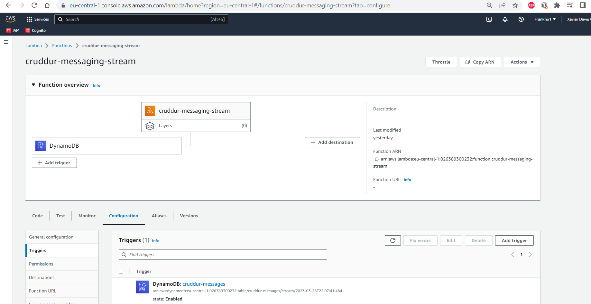
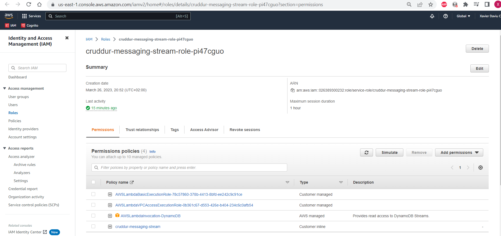

# Week 5 — DynamoDB and Serverless Caching

## As Homework I've done:

**Create a DynamoDB table with Provisioned Capacity.**

**Create the DynamoDB trigger to invoke Lamda function.**

**Create the Lambda function.**

**Setup the Lambda function trigger & permission policies.**

