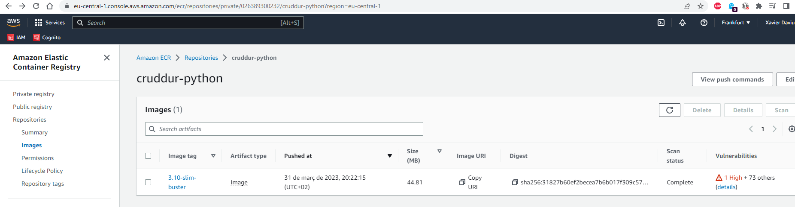
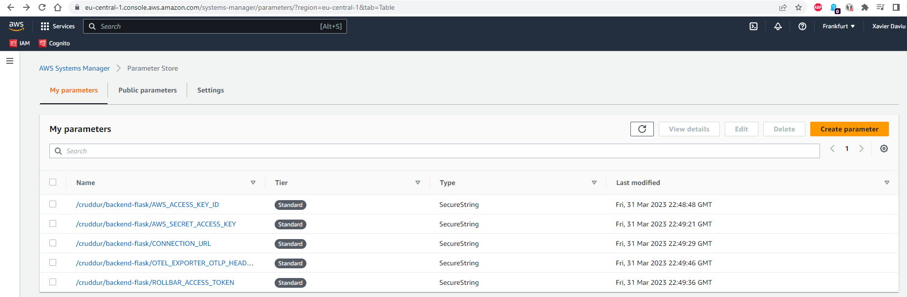
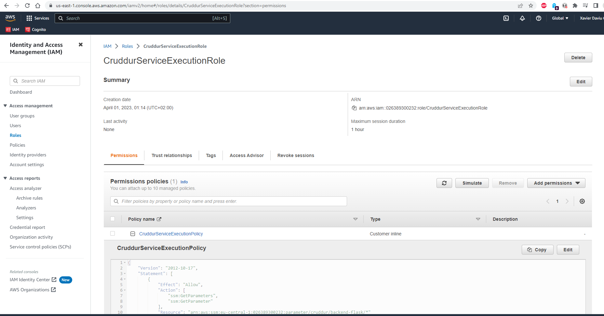
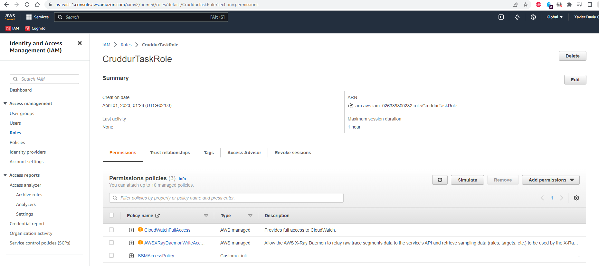
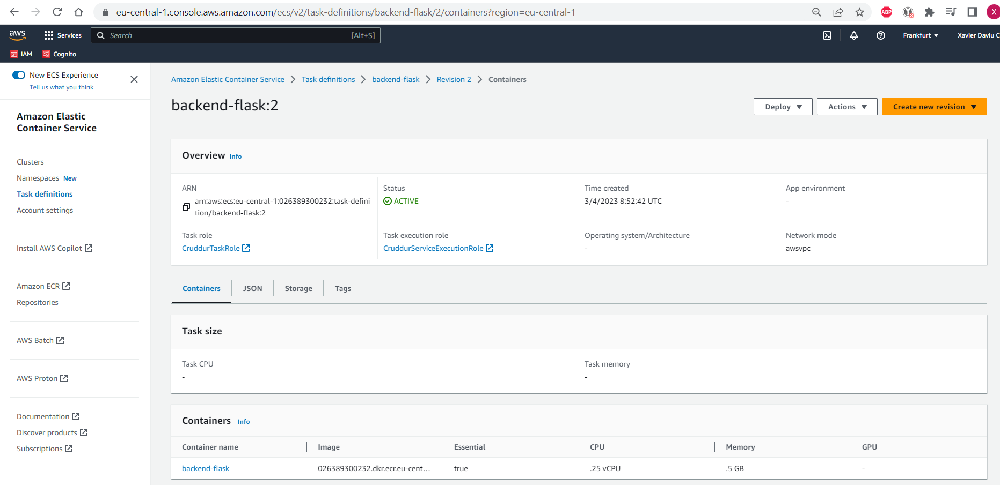
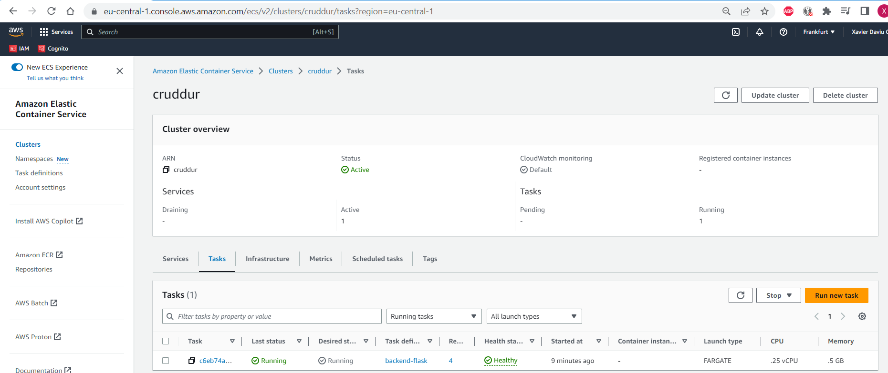
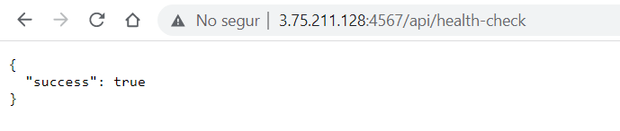
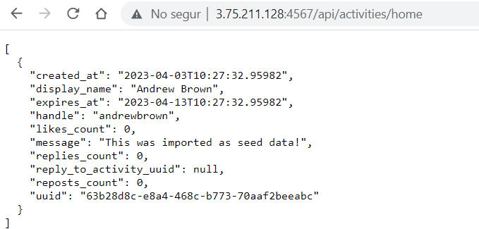

# Week 6 — Deploying Containers

## As Homework I've done:

**Create an ECR repository and push image**

**Create a Parameter Store in Systems Manager**

**Create the ServiceExecutionRole & TaskRole**

**Deploy an ECS Cluster & create the backend-flask task definition**

**Deploy serverless containers using Fargate for the Backend**

**Test the Backend**

**Deploy serverless containers using Fargate for the Frontend Application**

### Continue in Week7...
