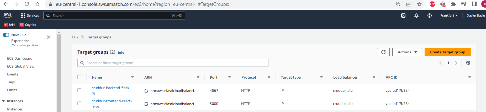
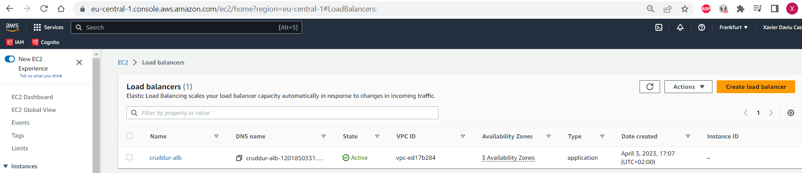
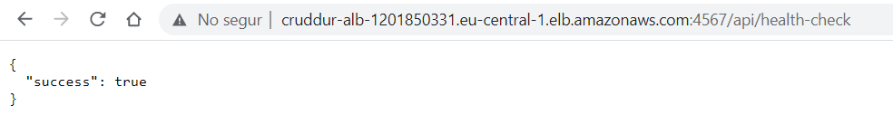
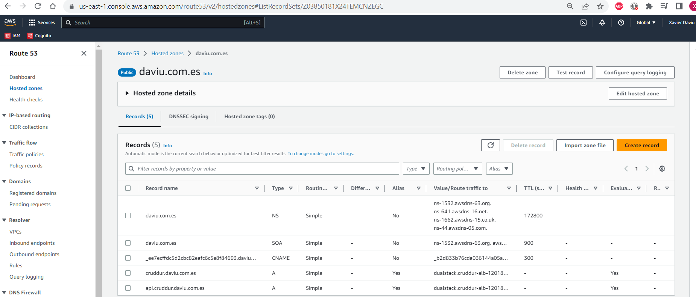
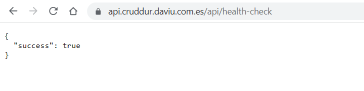
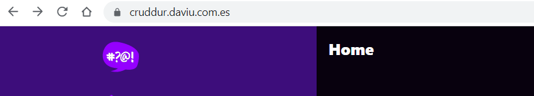

# Week 7 — Solving CORS with a Load Balancer and Custom Domain

## As Homework I've done:

**Create the Target Groups in Load Balancer**

**Create the Application Load Balancer & test it**

**Create the Hosted zone for the custom domain in Route 53 & SSL certificate**

**Test the custom domain for the Backend and Frontend Application**

**Create bash utility scripts to easily work with serverless containers**
