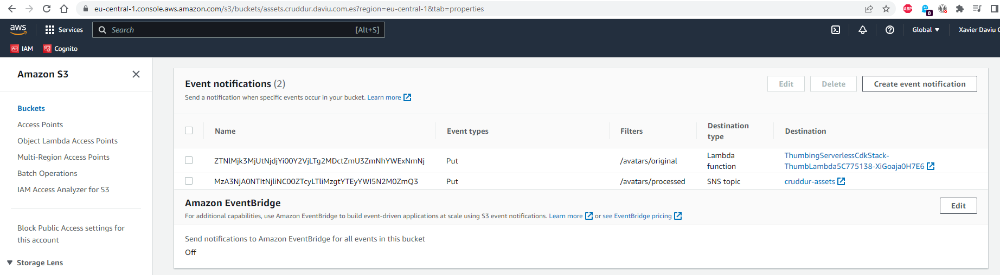

# Week 8 — Serverless Image Processing

## As Homework I've done:

**Create the CDK stack in CloudFormation**

**Create a S3 bucket to store assets & Lambda function**

**Upload image to S3 bucket & check logs**

**Create a CloudFront distribuition to serve assets**

**Create a lambda function to process images**

**Create a lambda function to authorize HTTP API Gateway**

**Create a HTTP API Gateway**

**Use Custom Domains in API Gateway**

**Implement profile avatar & banner in application**

