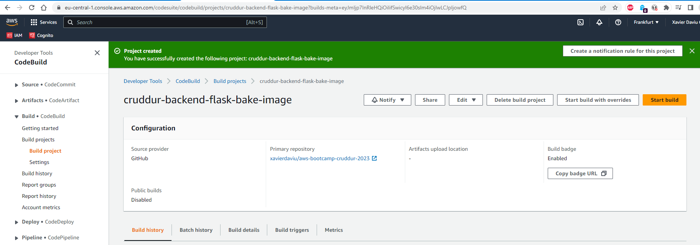
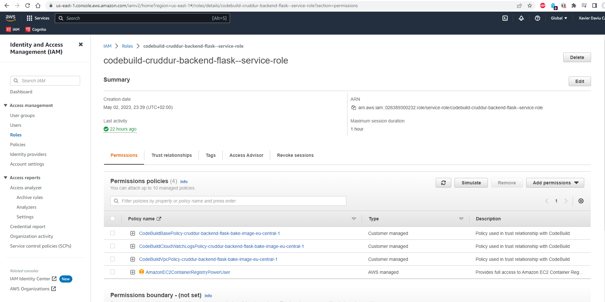
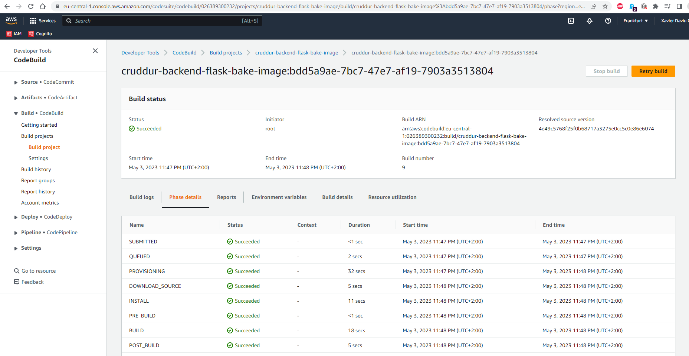
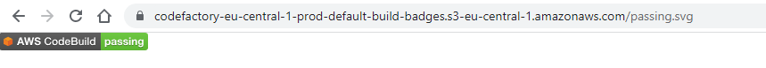
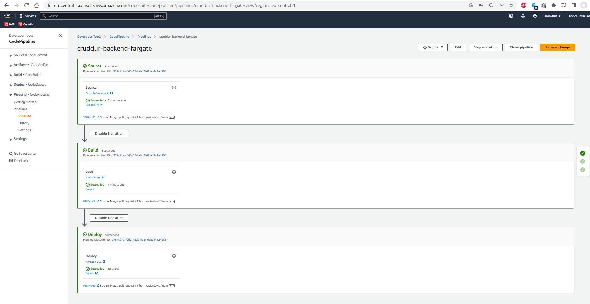
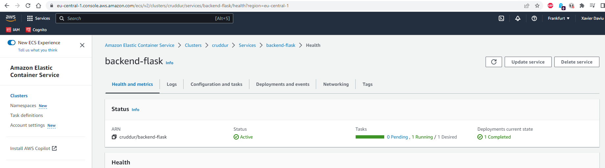

# Week 9 — CI/CD with CodePipeline, CodeBuild and CodeDeploy

## As Homework I've done:

**Create a CodeBuild project with a buildspec.yml file in source**

**Add the Container Registry permission police to CodeBuild role**

**Successfully build the project**

**Create a CodePipeline and successfully deploy it**

**Check the backend-flask service in ECS**

