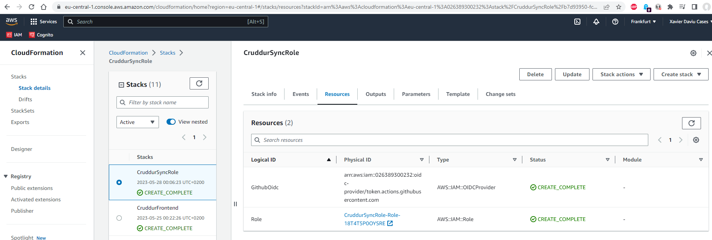
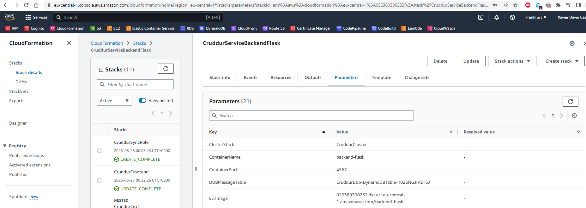
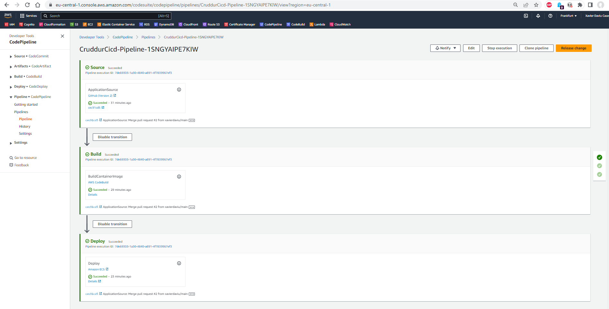
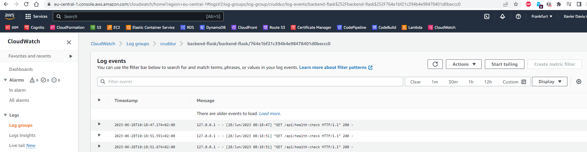
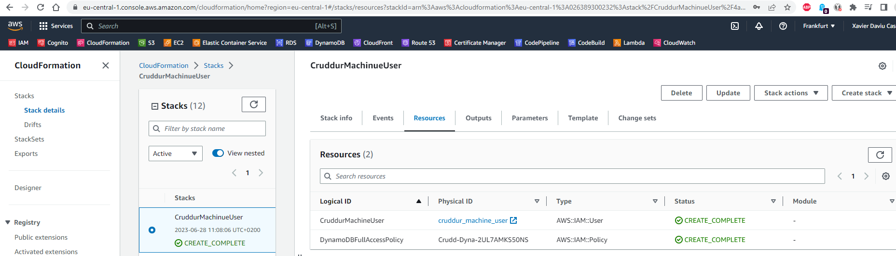
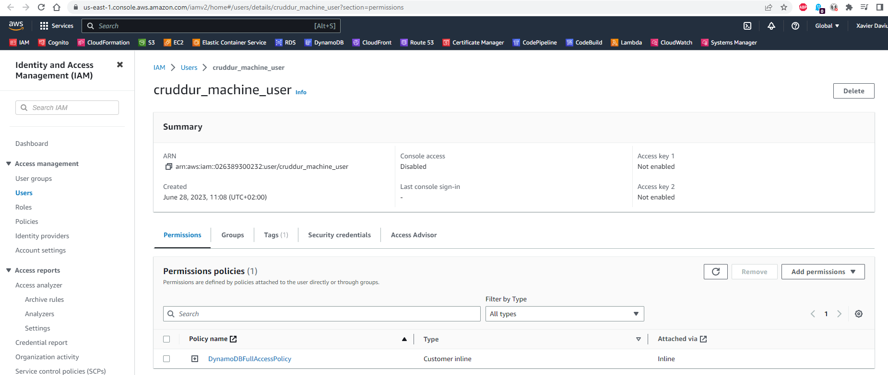
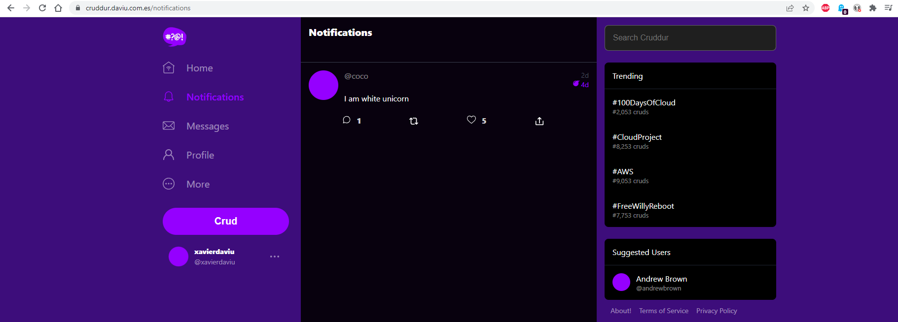

# Week X - Cleanup

## As Homework I've done:

**Create CloudFormation Stacks: SyncRole**

**Add DynamoDB message table to ServiceBackendFlask CloudFormation Stack**

**Build and Deploy production branch with CodePipeline**

**Check backend-flask service health in CloudWatch logs**

**Create CloudFormation Stacks: CruddurMachineUser**

**Check new cruddur_machine_user**

**Check application**

